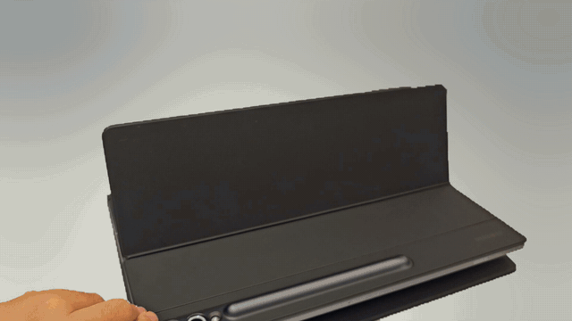
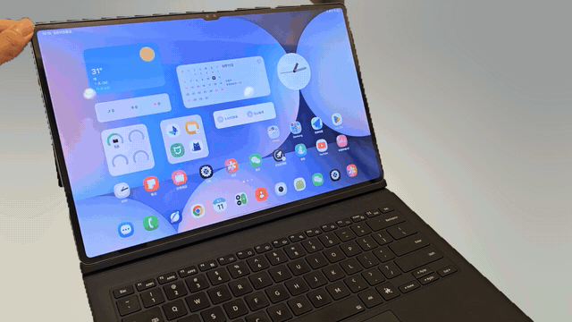

# TabFold

[简体中文](README.md) · **English**

**Desktop animations that follow your Samsung tablet as it opens and closes.** Unfold the screen to reveal the desktop; fold it back to reverse the effect. The animation follows pauses and changes in direction.

A free, open-source project maintained out of personal interest. Not affiliated with Samsung, Google or Apple.

[Download](https://github.com/6ZLeo/TabFold/releases) · [Compatibility](docs/COMPATIBILITY.md) · [Report an issue](https://github.com/6ZLeo/TabFold/issues)

## See it in action

| Opening the cover | Folding and opening again |
| :---: | :---: |
|  |  |

[Full demo video (10.8 seconds · 720p / 60 fps · Silent · 3.1 MB)](docs/media/tabfold-demo.mp4)

Shown on a Galaxy Tab S10 Ultra with an official Book Cover Keyboard. Results vary by device, system version and setup.

## Features

- **Motion tracking:** estimates the opening angle from the tablet's orientation to animate the home screen and lock screen.
- **Smooth closing:** detects small, continuous closing movements and follows changes in direction.
- **Device detection:** shows the device name, system version, display, motion sensors and keyboard connection status.
- **Personal adjustments:** calibrate the open position, change animation strength and enable or disable closing animations separately.
- **Lightweight mode:** uses transparent shading to reduce rendering load.
- **Local processing:** no network permission, ads or automatic uploads. Pause the feature or withdraw consent at any time.

## Download and setup

Download the signed APK from [Releases](https://github.com/6ZLeo/TabFold/releases) and check it against the supplied SHA-256 checksum. Android 13 (API 33) or newer is required. Root and a persistent computer connection are unnecessary.

The app interface and full risk, privacy and compatibility documents are currently in Simplified Chinese.

1. Install and open TabFold. Review the detected device, motion sensors and keyboard.
2. Read the risk disclosure and voluntarily enable the feature.
3. In Android **Accessibility → Installed apps**, enable **TabFold 开合盖动画**. The app cannot grant itself this permission. Setting names may vary by system language and One UI version.
4. Keep the connected keyboard base horizontal and stationary. Open the tablet to your preferred position and select **将当前位置设为完全展开** (“Set current position as fully open”).
5. Return to the system home screen and slowly close and open the cover. **到桌面试播** (“Preview on home screen”) runs a timed preview to check rendering; normal operation follows the estimated angle.

To stop, disable automatic animations in the app, select **撤回同意并停用** (“Withdraw consent and disable”), or turn off the TabFold service in Android's accessibility settings.

## Compatibility

| Item | Requirements |
| --- | --- |
| System | Android 13 / API 33 or newer |
| Device | A Samsung tablet with usable motion sensors |
| Keyboard | An official Book Cover keyboard; other physical keyboards can be allowed in settings |
| Position | Keyboard base horizontal and stationary, screen in landscape; move only the screen |
| Scene | System home screen and lock screen; protected lock screens use transparent shading |

**Model-name recognition is not a compatibility certification.** Check the [compatibility notes](docs/COMPATIBILITY.md) and [release notes](https://github.com/6ZLeo/TabFold/releases) for device-specific test coverage.

Tablet motion sensors cannot directly measure an independently moving keyboard hinge. Tilting the whole setup, using it on your lap or moving only the keyboard can cause incorrect estimates. Less capable devices, different One UI versions, DeX, multi-window use, portrait orientation and security policies may limit functionality.

When motion fusion is unavailable, gravity or accelerometer input can provide a basic fallback, with potentially greater error and latency during movement.

## Privacy and usage risks

Read the [risk disclosure](DISCLAIMER.md) and [privacy information](PRIVACY.md) before enabling the feature. The accessibility service identifies home-screen and lock-screen scenes, captures screen images where permitted and displays the animation layer. Screenshots stay briefly in memory and are not saved or uploaded.

The desktop effect uses a single in-memory screenshot, so live widgets resume updating visibly after the animation exits. When protected lock-screen capture is denied, the app uses transparent shading. This fallback does not transform the full lock-screen image or bypass authentication and screenshot protection. Automatic animations are limited to eligible home-screen and lock-screen scenes.

Closing detection and rendering may increase battery use and heat. Each animation lasts at most 12 seconds and exits when another app takes over or the screen turns off. Disable the feature and report the issue if you experience flickering, stuttering or unusual heat.

The software is provided as is, without a guarantee that it will work on every device. Liability is limited only to the extent permitted by applicable law. Mandatory rights and non-excludable liabilities remain unaffected.

## Build locally

Use JDK 17, Android SDK Platform 35 and Build Tools 35.0.0. Put your SDK path in your own `local.properties` and do not commit that file.

```sh
./gradlew testDebugUnitTest assembleDebug lintDebug
./gradlew assembleRelease
```

On Windows, use `gradlew.bat`. Sign release builds with your own key.

## License and credits

The project uses the [MIT license](LICENSE). The maintainer's non-profit purpose describes this project's publication; MIT permits commercial use without an additional non-commercial restriction.

Animation rendering is based on Elijah Semyonov's MIT-licensed [DuoLikeAnimation](https://github.com/elijah-semyonov/DuoLikeAnimation). See [third-party notices](THIRD_PARTY_NOTICES.md) for attribution and licenses.

Compatibility reports and improvements are welcome. Read the [contribution guide](CONTRIBUTING.md) and [security policy](SECURITY.md) before contributing.
